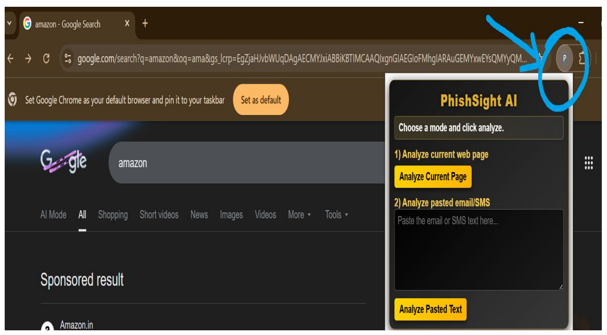
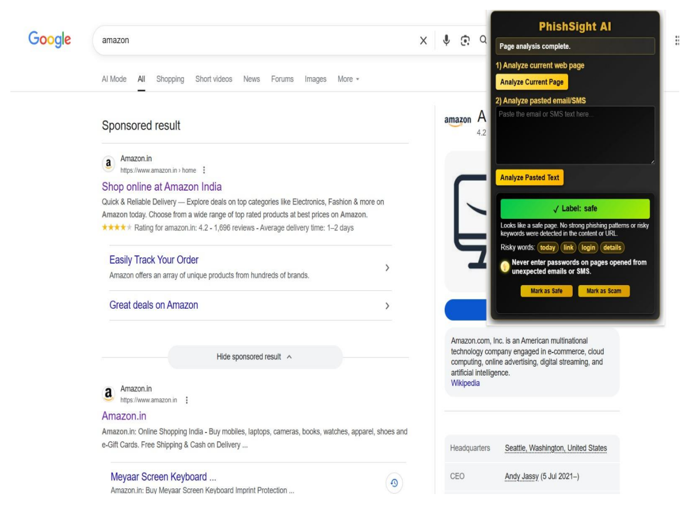
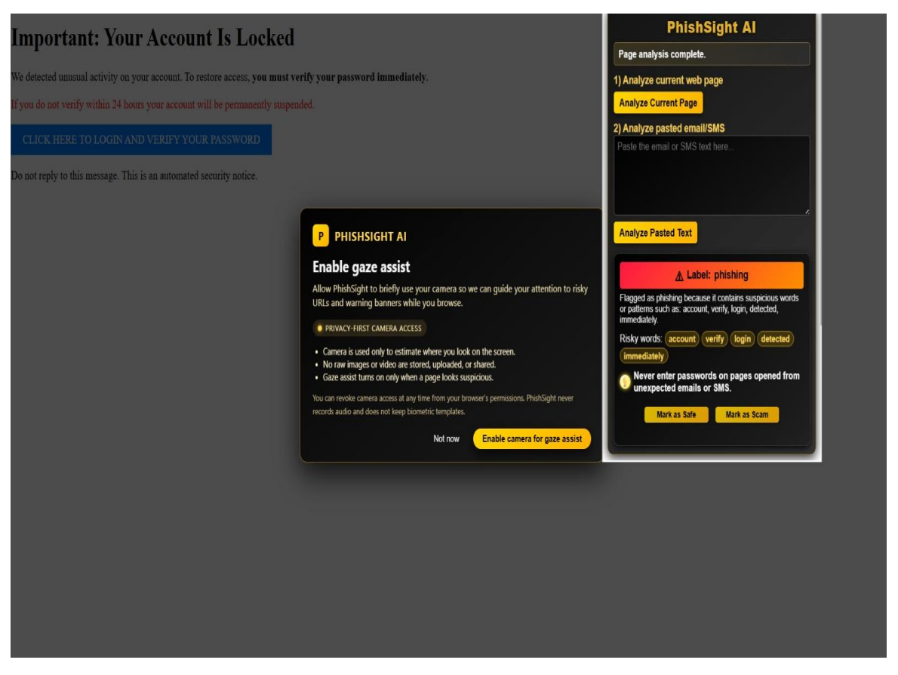
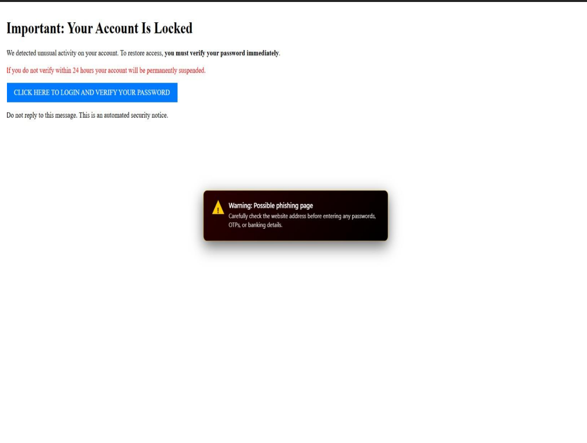
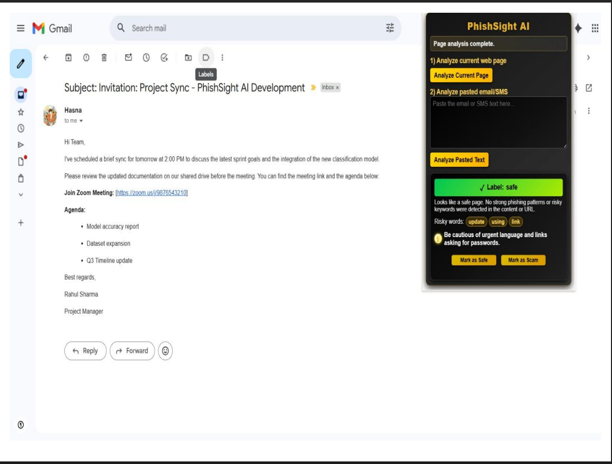
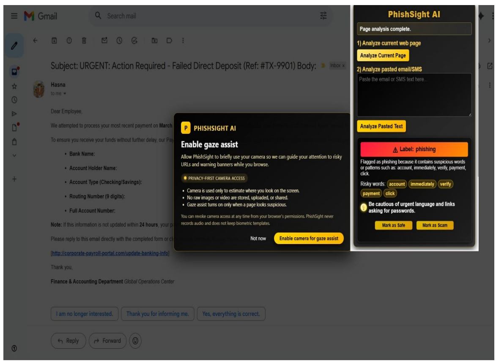

# PhishSight AI - Explainable NLP based Phishing and Scam Detection with Visual Attention Assist🛡️

PhishSight AI is an explainable, browser‑based phishing detection system that protects users across email, SMS, and web browsing. It combines machine learning, natural language processing, and URL analysis to flag suspicious content in real time through a lightweight Chrome extension connected to a FastAPI backend. Instead of acting as a black box, PhishSight AI highlights risky words, phrases, and URL features, and presents short security tips that non‑technical users can understand. An optional gaze‑assist module uses webcam‑based eye‑tracking to gently nudge users to check the sender and URL bar before clicking, while a built‑in “Mark as Safe/Scam” feedback loop continuously improves the models and helps the system adapt to new phishing tactics.

---

## 🎯 Objectives

- Detect phishing attacks in emails, SMS messages, and web pages using combined ML, NLP, and URL‑based features with high accuracy.  
- Provide explainable outputs that highlight risky tokens and URL traits and summarize, in plain language, why a message or page was flagged.  
- Deliver real‑time, in‑browser protection via a Chrome extension that analyzes the current page or pasted text without disrupting the user’s workflow.  
- Encourage safer user behavior using optional gaze‑tracking prompts and micro‑tips that remind users to verify sender identities and URLs before acting.  
- Enable continuous learning by logging predictions and collecting “Safe/Scam” feedback, then using this data to retrain and update models against evolving phishing campaigns.  

---

## 🧱 Tech Stack

- **Programming Language:** Python  
- **Backend:** FastAPI (for model inference APIs)  
- **Machine Learning:** scikit‑learn / other classical ML models (e.g., Random Forest)  
- **NLP & Feature Extraction:** URL feature engineering, text preprocessing  
- **Browser Extension:** HTML, CSS, JavaScript (Chrome extension manifest & scripts)  
- **Data Storage:** CSV‑based datasets and feedback logs  
- **Tools & Environment:**  
  - Git & GitHub for version control  
  - Virtual environments (venv/conda) for Python dependencies  

---

## 📁 Repository Structure

> This repository only contains source code and light assets. Large model and dataset files are hosted on Google Drive due to GitHub size limits.

- `main.py` – Runs phishing detection using the trained model.  
- `train_model.py` – Training script for phishing/legitimate URL classification.  
- `extension/` – Browser‑extension UI (HTML, JS, manifest) for in‑browser checks.  
- `feedback.csv` – User feedback log for “Safe/Scam” responses (if enabled).  
- `.gitignore`, `.gitattributes` – Git configuration files.  

---

## 📦 Full Project ZIP (Models + Datasets)

The complete project (trained models, large CSV datasets, and other heavy resources – around 850 MB) is stored on Google Drive.

🔗 **Download full project ZIP:**  
https://drive.google.com/file/d/1xbeksFz2morivI6UgAl_1nlpUC9o_ZZx/view?usp=drive_link  

After downloading, extract the archive and place the model and data files in the appropriate locations (for example, `models/` and `data/`) as expected by `main.py` and `train_model.py`.

---

## 🚀 How to Run

### 1️⃣ Clone the repository

```bash
git clone https://github.com/<your-username>/PhishSight_AI.git
cd PhishSight_AI
```

### 2️⃣ Set up the Python environment

```bash
python -m venv venv
# Windows
venv\Scripts\activate
# Linux / macOS
source venv/bin/activate
```

Install dependencies (if you have a `requirements.txt`):

```bash
pip install -r requirements.txt
```

### 3️⃣ Download models and data

1. Download the ZIP from the Google Drive link above.  
2. Extract it and place the model files (for example, `phish_model.pkl`, `phish_url_rf.pkl`, `url_feature_names.pkl`) and datasets (for example, `phishing_site_urls.csv`) into the expected directories.

### 4️⃣ Run the phishing detector

```bash
python main.py
```

If using FastAPI:

```bash
uvicorn main:app --reload
```

Then use the browser extension or an API client to send URLs/messages to the backend for classification.

---

## 🧩 Browser Extension (Optional)

- Open `chrome://extensions/` in Chrome.  
- Enable **Developer mode**.  
- Click **Load unpacked** and select the `extension/` folder.  

Once loaded, the extension can call the backend to analyze the active tab or user‑pasted text and display phishing/legitimate predictions with explanations.

---

## 🖼️ Sample Output Screens

Below are some example screens from PhishSight AI demonstrating how the extension works in different scenarios.

### 1. Extension popup on a web page

The browser extension appears on the current page and lets the user analyze the active site or pasted text.



### 2. Web page analysis – safe vs phishing

PhishSight AI analyzes the current web page content and URL, then labels it as safe or phishing with explanations and risky words.

- Safe web page (green label):



- Phishing web page (red label with gaze assist available only for phishing):



### 3. Gaze‑assist warning on risky pages

If the user is not looking at the domain/URL area before clicking, a subtle warning reminds them to verify the address first.



### 4. Email analysis

PhishSight AI can also analyze email content and classify it as safe or phishing, highlighting risky words and giving short safety tips.

- Safe email example:



- Safe email example (additional case):



### 5. SMS / message analysis

The system can analyze SMS or short messages and detect both safe and phishing patterns.


## 👩‍🎓 Academic Project

PhishSight AI was developed as an academic project focusing on secure, explainable phishing detection and user‑centric security awareness.

---

## 👤 Author

**Afiqa**  

- 📧 Email: [afiga97@gmail.com](mailto:afiga97@gmail.com)  
- 🔗 LinkedIn: [https://www.linkedin.com/in/afigabegum/](https://www.linkedin.com/in/afigabegum/)  

If you use or build on PhishSight AI, feel free to reach out or open an issue/PR. Contributions, suggestions, and feedback are welcome! ✨
